# Exercise1: Azure利用準備

## 【目次】

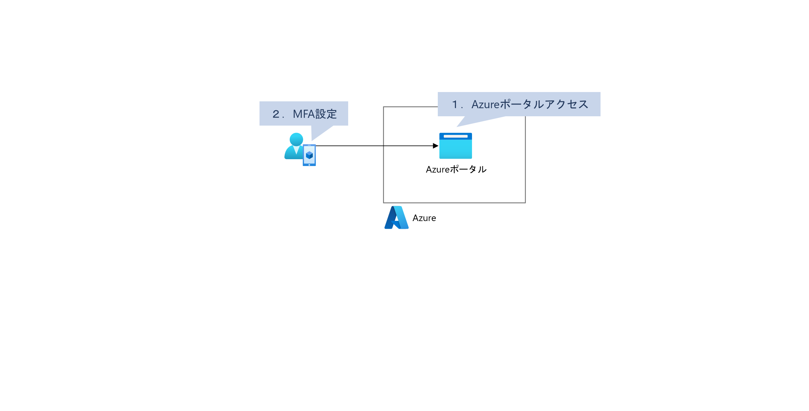

1. [Azureポータルへアクセス](#azureポータルへアクセス)
2. [MFA(Multi Factor Authentication)設定](#mfamulti-factor-authentication設定)

## Azureポータルへアクセス

1. アカウント作成ができていない場合、あらかじめアカウント作成しておく

    [Azure の無料アカウント](https://azure.microsoft.com/ja-jp/free/dotnet/)

1. 「Azureポータル」へアクセスしてログイン

    [Azure ポータル（https://portal.azure.com/）](https://portal.azure.com/)

## MFA(Multi Factor Authentication)設定

MFA設定はログインしているアカウントの種類によって画面遷移が若干異なります。
ログインしているアカウントの種類に応じて手順を確認してください。

* [Microsoftアカウントの場合](#microsoftアカウントの場合)
* [組織アカウントの場合](#組織アカウントの場合)

### 【Microsoftアカウントの場合】

1. Azureポータルへログイン
1. 画面右上のアカウント名を展開

    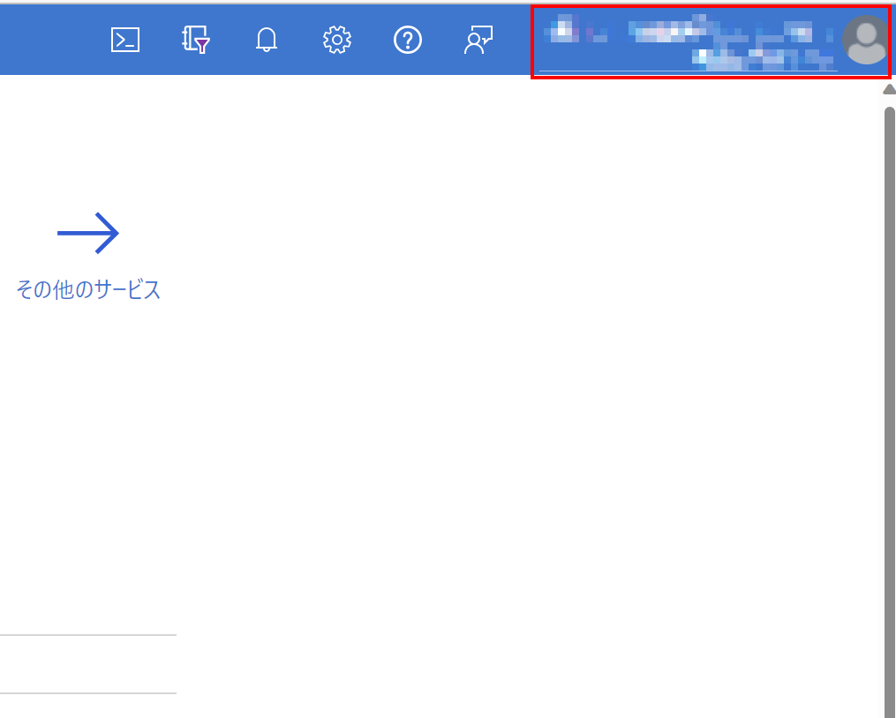

1. 「Microsoftアカウント」を選択

    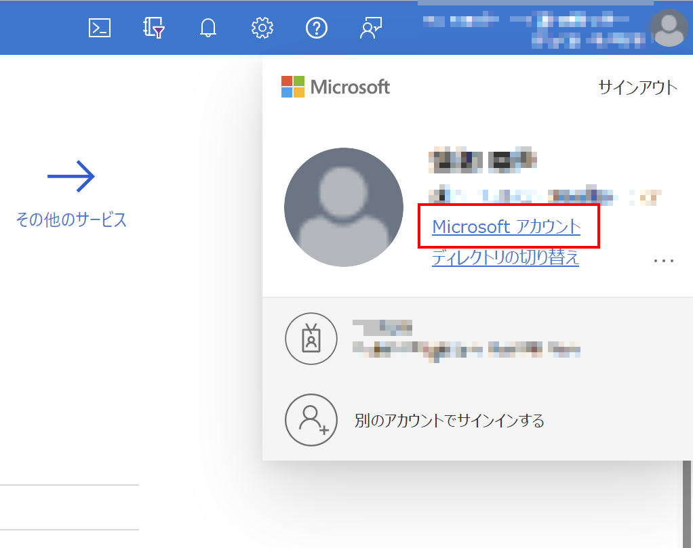

1. 「Microsoftアカウント」ページ上部メニューから「セキュリティ」を選択

    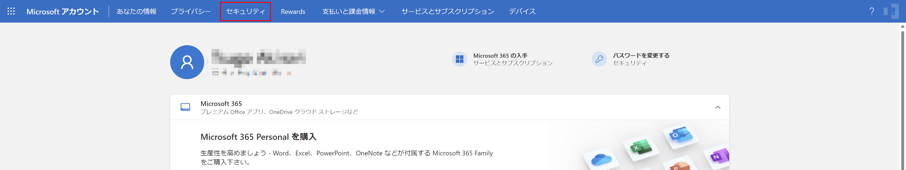

1. 「高度なセキュリティオプション」を選択

    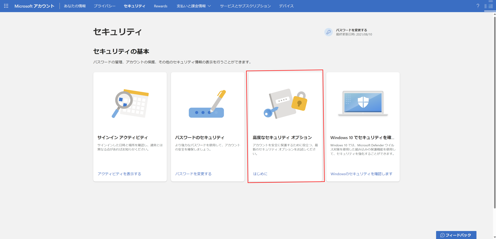

1. 「2段階認証」を選択

    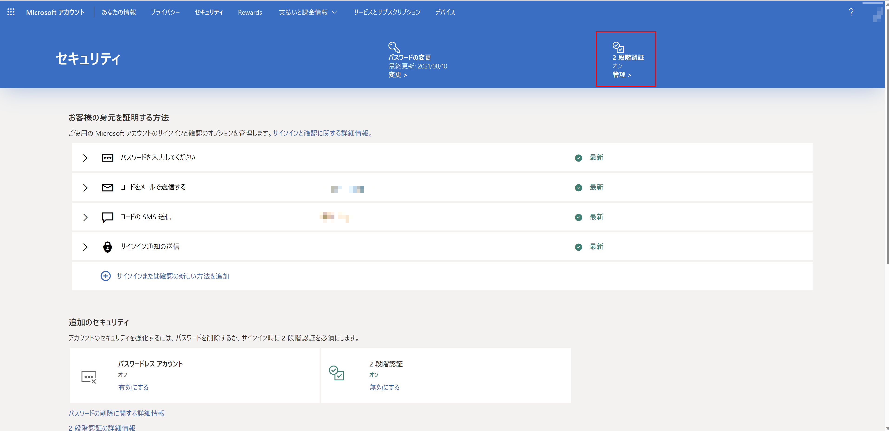

1. ガイドに従ってMFA設定

    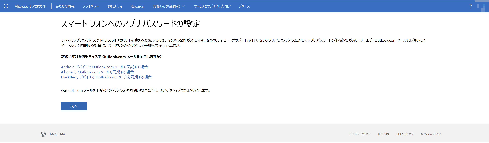

### 【組織アカウントの場合】

1. Azureポータルへログイン
1. 画面右上のアカウント名を展開

    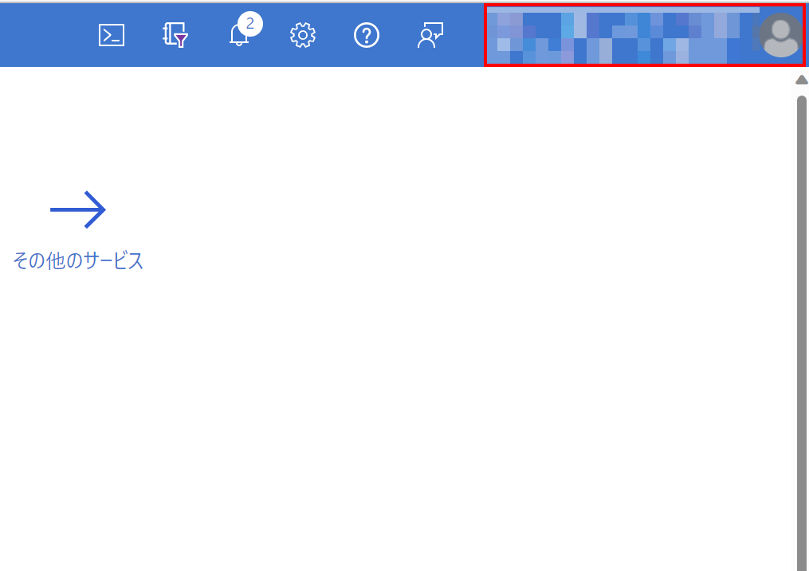

1. 「アカウントを表示」

    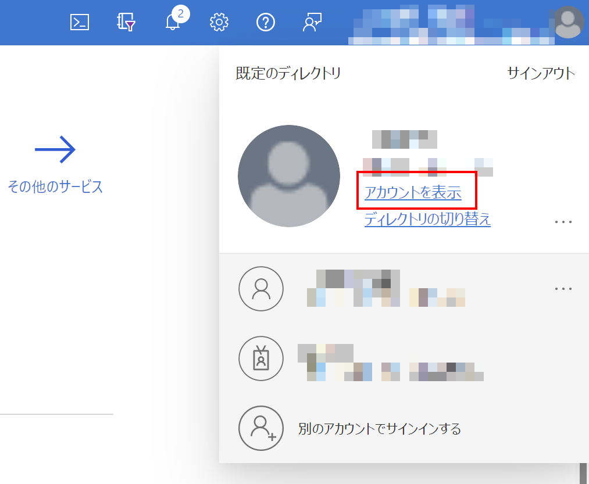

1. 「マイアカウント」ページ左メニューから「セキュリティ情報」を選択

    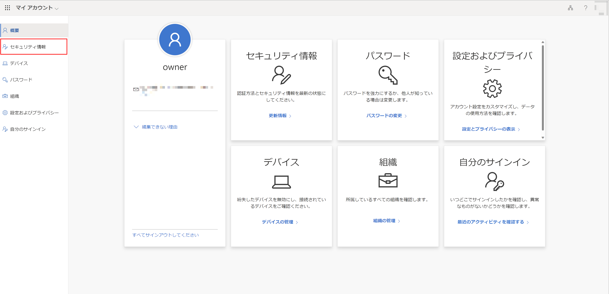

1. 「サイインインの方法の追加」を選択

    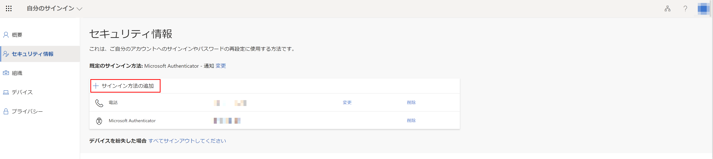

1. 「認証アプリ」を選択して「追加」

    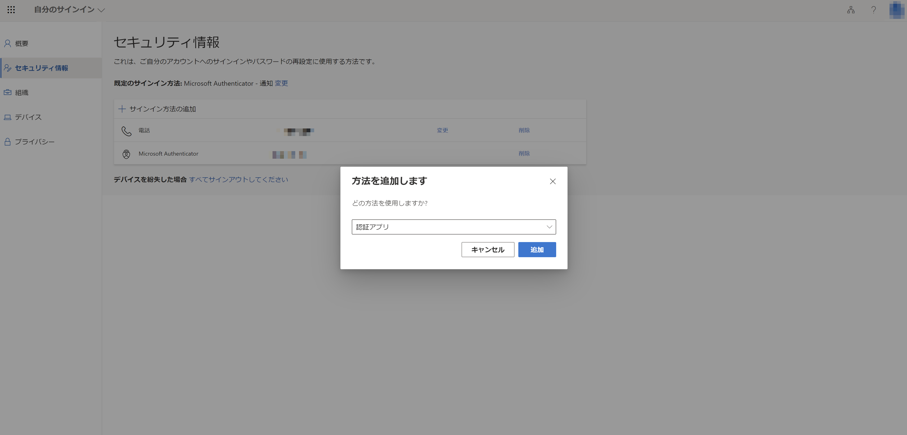

1. ガイドに従ってMFA設定

    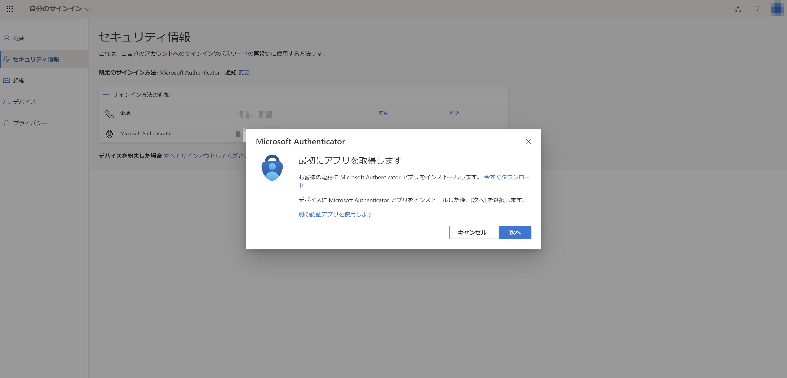

