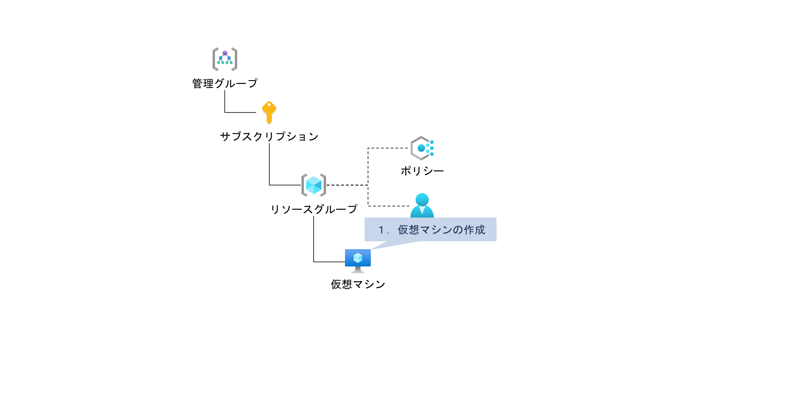
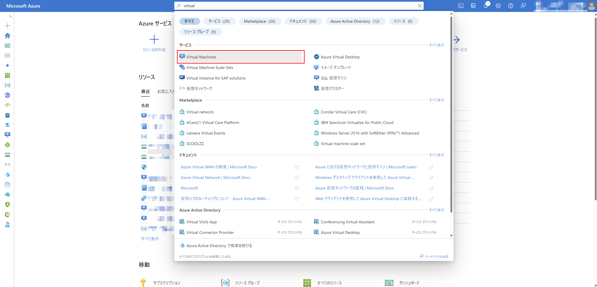
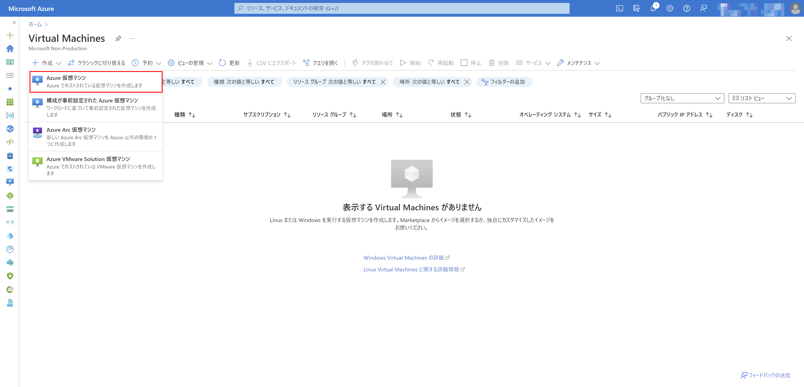
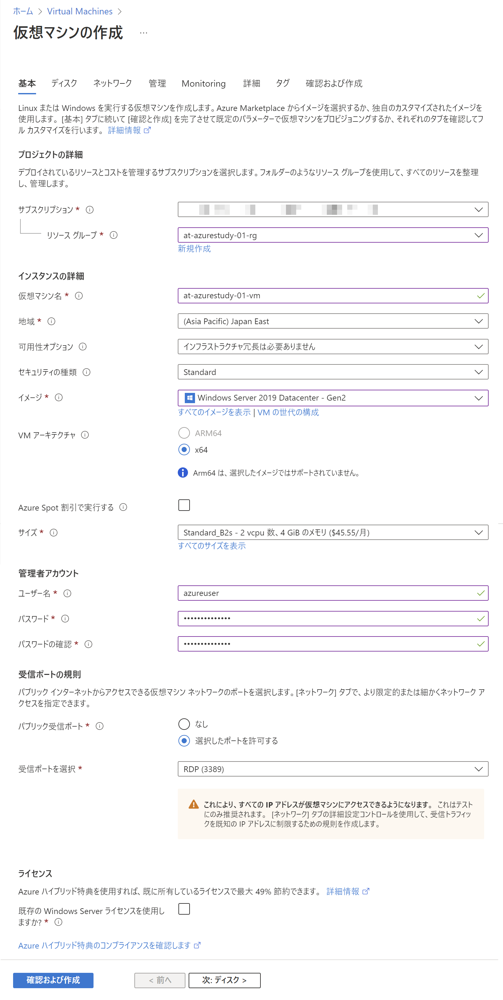
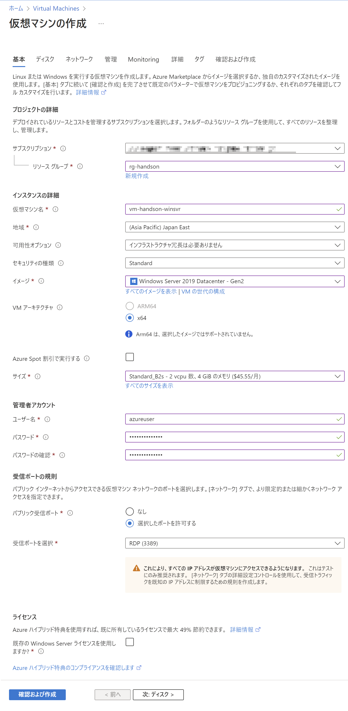

# Exercise5: 仮想マシン作成

## 【目次】

1. [仮想マシン作成](#仮想マシン作成)

## 仮想マシン作成

1. Azureポータル上部の検索窓で「Virtual Machines」を検索、開く

    

1. [作成]-[Azure仮想マシン]を選択

    

1. 仮想マシンの作成

    1. サイズがポリシーによって制限されていることを確認

       「基本」の 「サイズ」にて「すべてのサイズ」を選択した際、ポリシーで制限されていることを確認

       (*) ポリシーが反映されるまで時間がかかります。
            反映されていない場合、しばらく待ってから再度確認してください。

        

    1. 以下の設定をして「確認および作成」

        * サブスクリプション： （今回指定のサブスクリプション）
        * リソースグループ： （作成済みのリソースグループ）
        * 仮想マシン名： （任意）
        * 地域： `Japan East`
        * イメージ： `Windows Server 2019 Datacenter`
        * サイズ： `Standard_B2s` 
        * ユーザー名、パスワード： （任意）

        

    1. 「確認および作成」で内容を確認して「作成」
