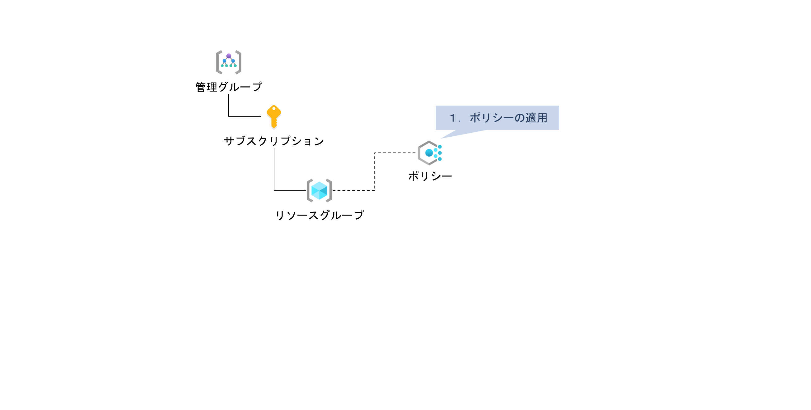
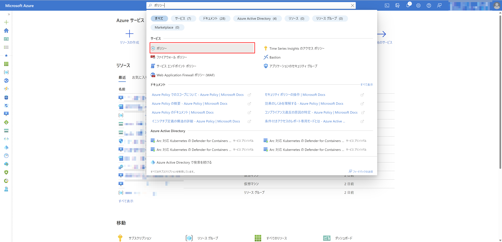
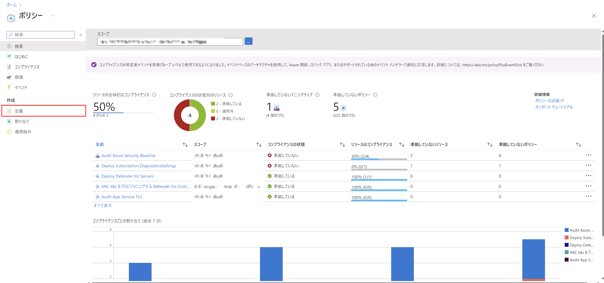
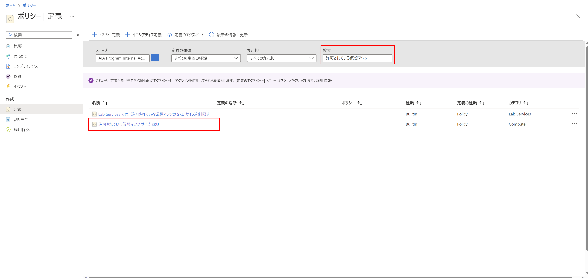
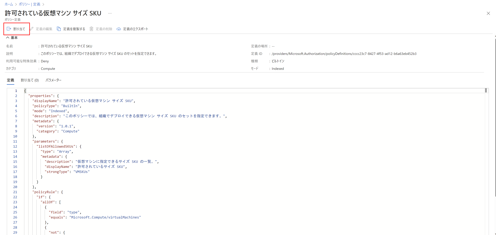
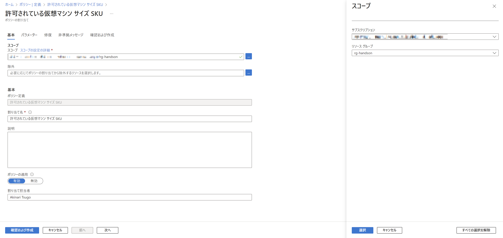
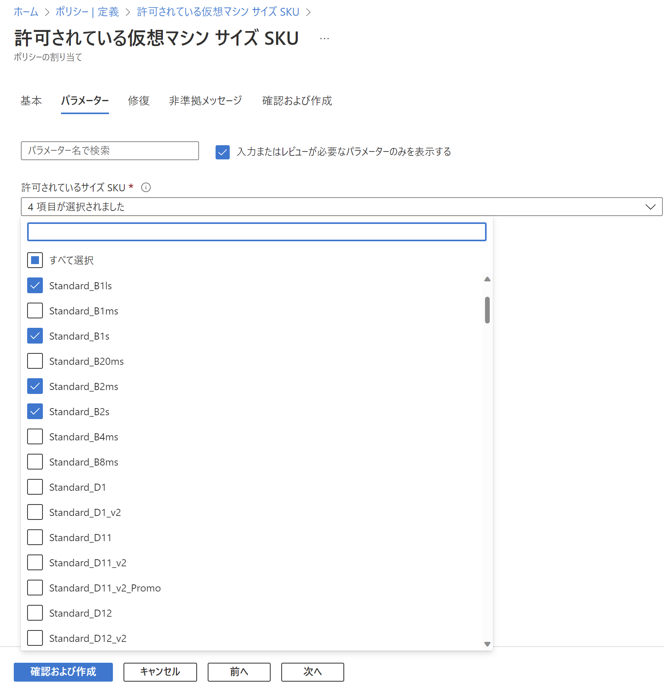
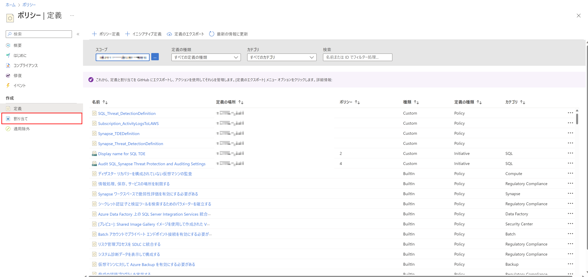
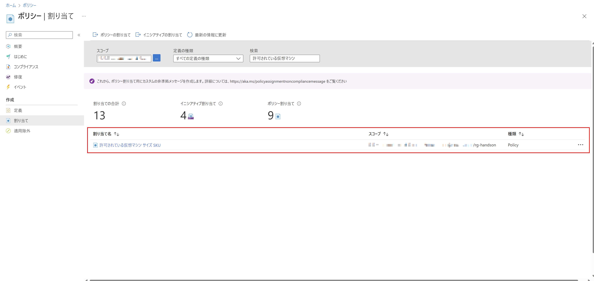
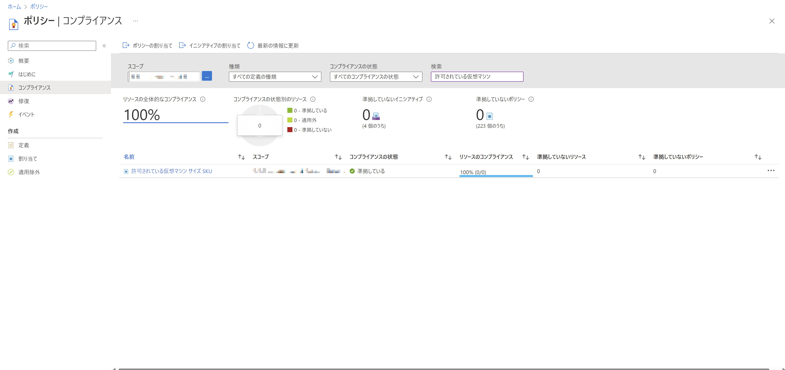

# Exercise3: ポリシーの適用

## 【目次】

1. [リソースグループにポリシーを適用](#リソースグループにポリシーを適用)
1. [ポリシー準拠状況の確認](#リソースグループにポリシーを適用)

## リソースグループにポリシーを適用

1. Azureポータルの上部検索窓にて「ポリシー」を検索

    

1. [作成]-[定義]を開く

    

1. 「検索」を利用して以下のポリシーを探す

    * 許可されている仮想マシン サイズ SKU

    

1. ポリシーの「割り当て」を選択

    

1. ポリシーの割り当て

    1. 基本

        * スコープ： (前の手順で作成したリソースグループを選択)
        * 除外： (なし)
        * 割り当て名： (任意。デフォルトまま)

        

    1. パラメーター

        * 許可されているサイズ SKU： (Standard_B1ls, B1s, B2ms, B2s の4種類を選択)

        

    1. 修復, 非準拠メッセージ

        特に指定なし
    
    1. 確認および作成

        内容を確認して「作成」

1. ポリシーの [作成]-[割り当て] へ移動

    

1. 割り当てたポリシーが存在することを確認

    

## ポリシー準拠状況の確認

1. ポリシーの[コンプライアンス]を開く

    

1. 検索で絞り込みを行い、準拠状況を確認

    (*) 現時点ではリソースが何もないので 100% になる

    

