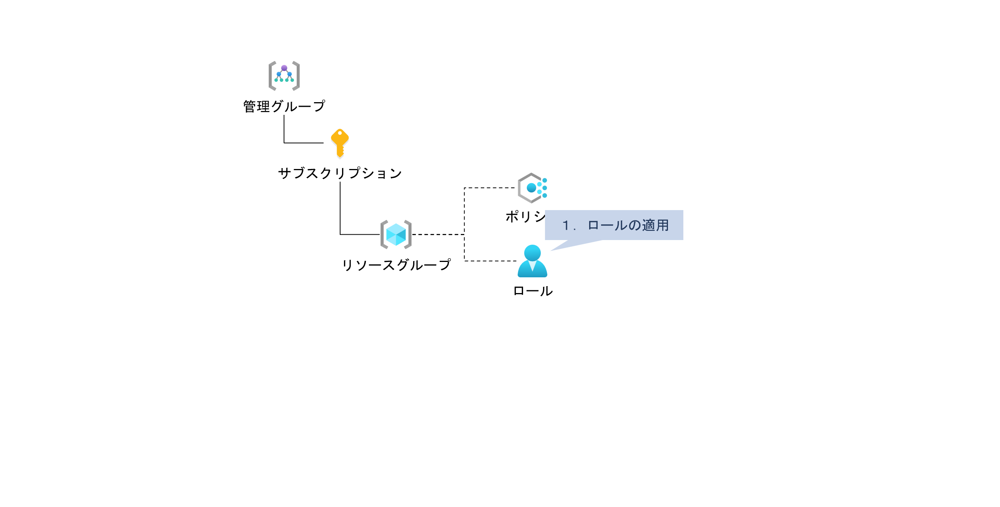
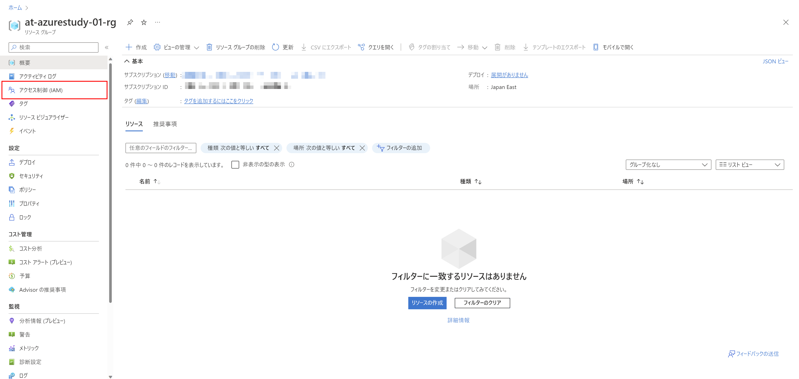
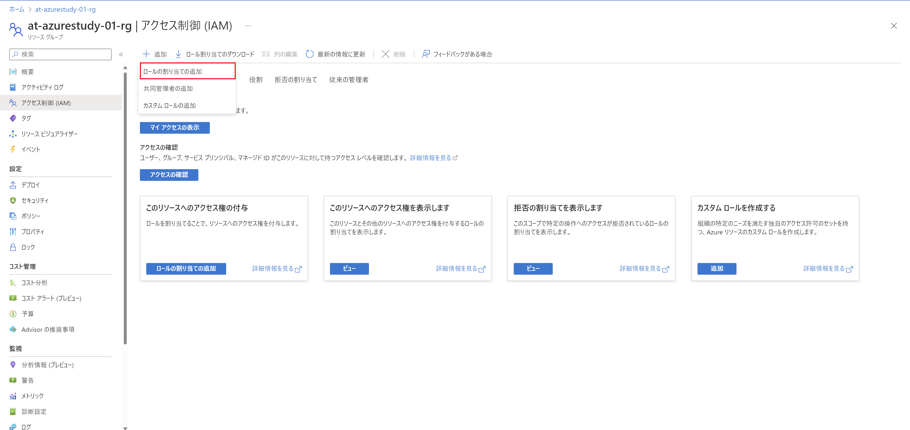
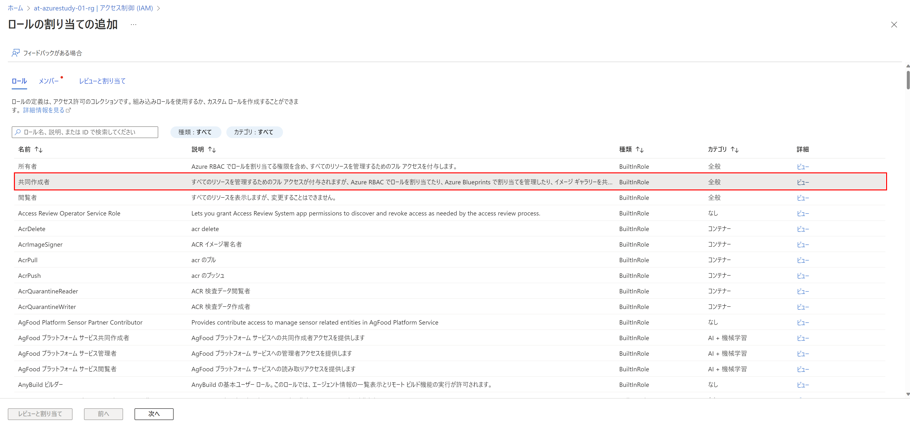
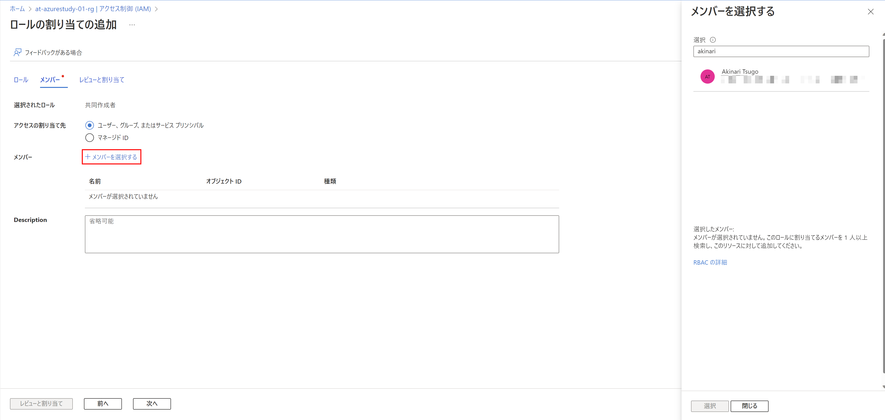

# Exercise4: ロールの適用

## 【目次】

1. [自分自身にロールを適用](#自分自身にロールを適用)

## 自分自身にロールを適用

1. Azureポータルから作成した「リソースグループ」を開く

1. 「リソースグループ」の一覧から作成済みのリソースグループを選択

1. 「アクセス制御（IAM）」を開く

    

1. [追加]-[ロールの割り当ての追加]を選択

    

1. ロールの割り当て

    1. ロール
    
        「共同作成者」を選択して「次へ」

        

    1. メンバー
    
        「メンバーを追加する」を選択、
        右メニューにて、自分自身を検索して「選択」
        登録されたら「次へ」

        

    1. レビューと割り当て
    
        内容確認して「レビューと割り当て」

1. 「ロールの割り当て」タブへ移動して、割り当てたユーザーが存在することを確認

    

